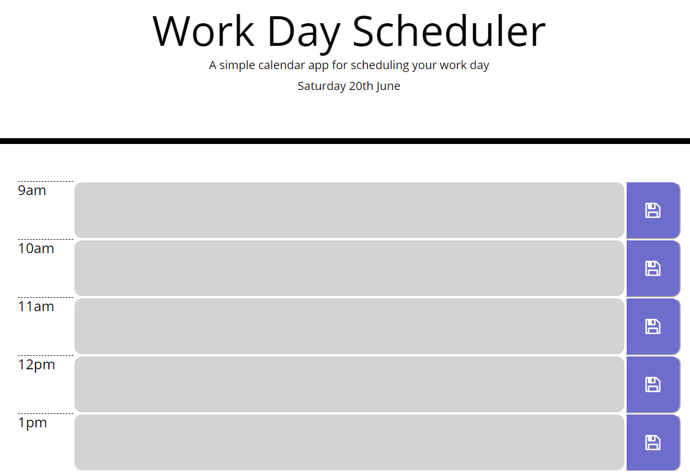
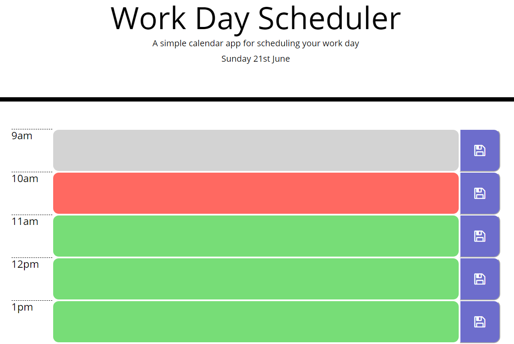

# Work-Day-Schedular
05 Third-Party APIs: Work Day Scheduler

https://cr-53.github.io/Work-Day-Schedular/Develop/index.html

## Task Description
The task for this week was to create a calendar scheduler for the average work day hours of 9am - 5pm. The schedulaer had to display the current date at the top of the page using moment.js. It also had to feature timeblocks for every hour, with the background colour of each individual timeblock being determined by the current time. The functionality of the Work Day Scheduler had to allow users to type in a multi-line text area input field and save their text via clicking a corresponding button.

## HTML/CSS Layout 
I started this task by building the layout of the schedular using HTML and CSS. I tried a lot of different HTML methods including using a table and using a list, but I decided to go with using bootstrap rows & columns to create the layout of the timeblocks. I made sure to give every text area field and every save button a unique ID which I could then utilize in my javascript.

## Moment.js

## Changing Timeblocks Background

## Saving User Input

## Periodically Updating Page

## Licesense & Copyright
